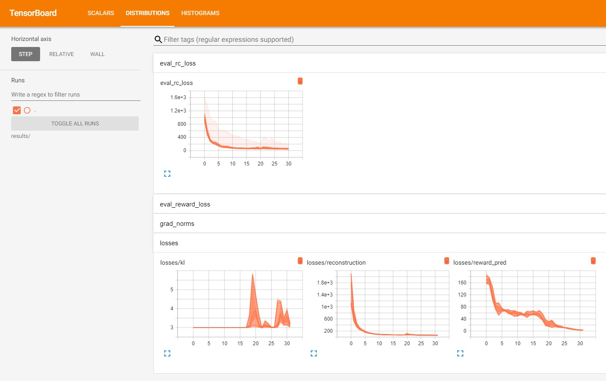

# dreamer-pytorch
[](LICENSE.md)

A PyTorch Implementation of PlaNet: A Deep Planning Network for Reinforcement Learning [[1]](#references) by Danijar Hafner et.al. 

### Usage
 - Run `main.py` for training.
 - Run `eval.py` for evaluation of a saved checkpoint.
 - Tensorboard will be used to display and store metrics and can be viewed by running the following:
 ```shell
 $ tensorboard --logdir <path_to_repository>/results
 ```
 - Visit tensorboard in your browser! By default tensorboard launches at `localhost:6006`. You might see a screen similar to this:
 

### Results
The video on the **left** is the downscaled version of the **gym render**.  
The one on the **right** is **generated** by the decoder model.
#### During Training


#### After Training


### Installation and running!
Install dependencies ...
- `pytorch==1.4.0`
- `tensorboard-pytorch==0.7.1`
- `tqdm==4.42.1`
- `torchvision==0.5.0`
- `gym==0.16.0`

References & Acknowledgements
-----------------------------
 - [Learning Latent Dynamics for Planning from Pixels][paper]  
 - [google-research/planet] by [@danijar]  
 - [PlaNet] by [@Kaixhin]  

[Website]: https://danijar.com/project/planet/
[paper]: https://arxiv.org/abs/1811.04551
[@danijar]: https://github.com/danijar
[@Kaixhin]: https://github.com/Kaixhin
[PlaNet]: https://github.com/Kaixhin/PlaNet
[google-research/planet]: https://github.com/google-research/planet
